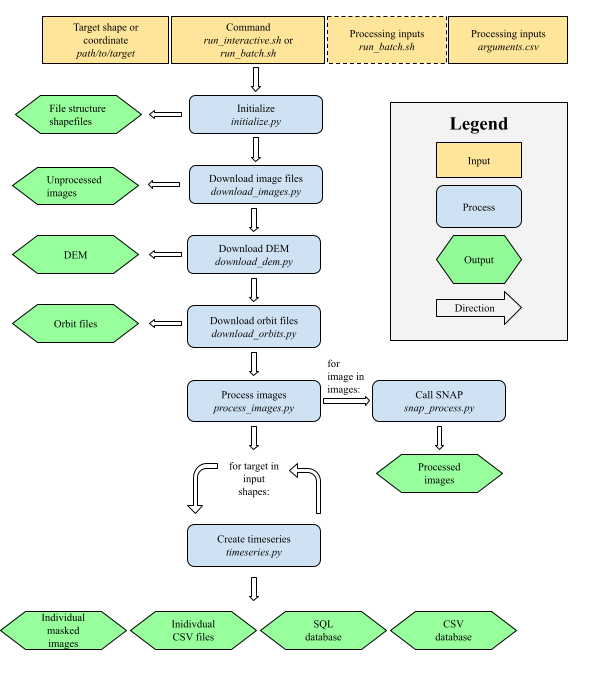
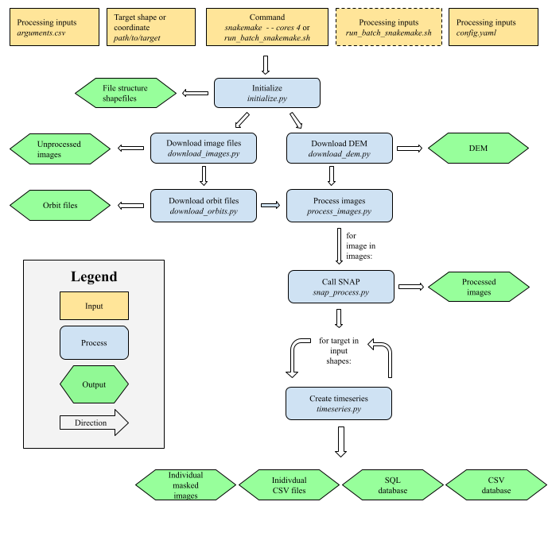
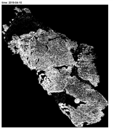

# Welcome to SARP Documentation

 

Welcome to the SARP project documentation! This page includes the full description of SARP, how to install it properly, and how to run different configurations.

SARP (Sentinel-1 Automated Retrieval and Processing) is an automated Sentinel-1 SAR image download, process, and analysis pipeline for SAR images in Finland. The script is run from the command line interface of Puhti, either in interactive or batch mode. It can download and process both Ground Range Detected (GRD) and Single-look Complex (SLC) images. Additionally, polSAR image processing is possible.

The outputs of this program are:

- Processed, masked SAR images for the entire target (if -b is enabled, more on that later) and/or for each polygon separately (if -p is enabled)

- A .csv file of all bands' mean values, for each target polygon as well as all targets in one .csv. For GRD, min, max, and std values are saved as well.

- An SQL database of all target's band values, along with ID, orbit, processingLevel, look direction, and pixel count info.

- Shapefiles of the targets

- A 2m DEM and shapefile(s) of the target area(s)

- Optional benchmark file

  

## Software description
 
SARP can be utilized in two ways, either traditionally using a linear process, or with Snakemake in a way that is optimized for high-performance computing. Snakemake is generally recommended especially for larger datasets, but debugging can be more difficult.

The software generally does the following:  
1. Create output file structure and process either coordinates, shapefiles, or geopackages to individual polygons or a single large shapefile
2. Download images, either GRD or SLC
3. Download orbit files if required
4. Download and crop DEM of the target area
5. Process images
6. Create masked images and create databases of the data.

The flow of the software is described in Figures 1 and 2, where the first figure shows the linear process, and the second figure shows the more parallellized Snakemake version. Both of these show a version where the images are downloaded in bulk, i.e. one image is presumed to cover the entire target area. If bulk_download = False (see [setup](setup.md)), the entire process is simply repeated indiviudally for each polygon.

**Figure 1: SARP Process**

**Figure 1: SARP Process with Snakemake**

